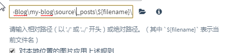

## hexo上传github 后图片不显示问题

- 在文件夹下找到_config.yml 文件 将`post_asset_folder: `修改为true

- 将上面的参数修改后 直接`hexo new 文件名`  会自动创建出一个跟文件同名的文件夹 ，将图片等资料都放到文件夹中

- 下载依赖~` npm install hexo-asset-image https://github.com/CodeFalling/hexo-asset-image`

  - 注意下载 依赖一定要后面的网址  这接`hexo-asset-image` 会下载最新版 还会导致图片不显示

- 使用typroa修改图片路径    下面这种方法typroa会自动保存到命名文件夹下

  

## 注意事项

**编辑好md文档先在`hexo server` 运行一下在提交github**

```js
Markdown 使用时（） { } 都需要转义 否者会报错
```


 